# Exploring OpenShift 4.2 Lab

In this session, you will play a game with OpenShift objects as targets. This game can hopefully help you to better understand OpenShift objects and their intricate relationships. The session starts with an overview of what an OpenShift application is. You will deploy an application to our cluster in your own project and work with its objects to gain a better understanding of how OpenShift objects work.

## Introduction

- Application overview
- Working with an application
- Kubernetes resources


## Step 1 - Accessing OpenShift and preparing your environment

Before you work with this lab, you must have the following pre-requisites:

- A Web browser (Chrome or Safari or Firefox)
- Familiarity with running CLI commands in your environment
- Git command line - see https://gist.github.com/derhuerst/1b15ff4652a867391f03
- The `oc` command - download from https://mirror.openshift.com/pub/openshift-v4/clients/ocp/latest/. Install `openshift-client`, not `openshift-install`.

Make sure your environment has the necessary prerequisites.

Lets start with you logging into the cluster. You will be assigned a URL and a login id.

- Console URL: `https://console-openshift-console.apps.ocp42faststart-aws.faststart.tk`
- User ID: `userXX`
- Password:  _________

Follow these instructions to perform the exercise:

1. Open a Web browser and go to the Console URL.

2. Login with your user ID and password. <br>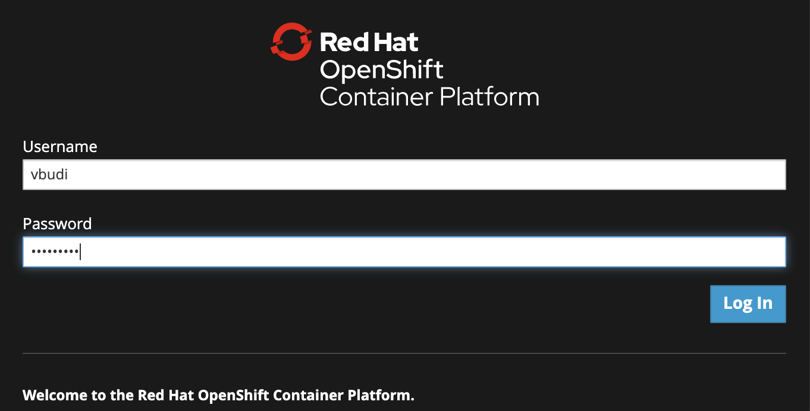

3. The view on the OpenShift console is the Application Developer view. If you are in the Adminstrator view, select the Administrator drop down and choose Developer. <br>

4. Click the project dropdown and select **Create Project**. <br>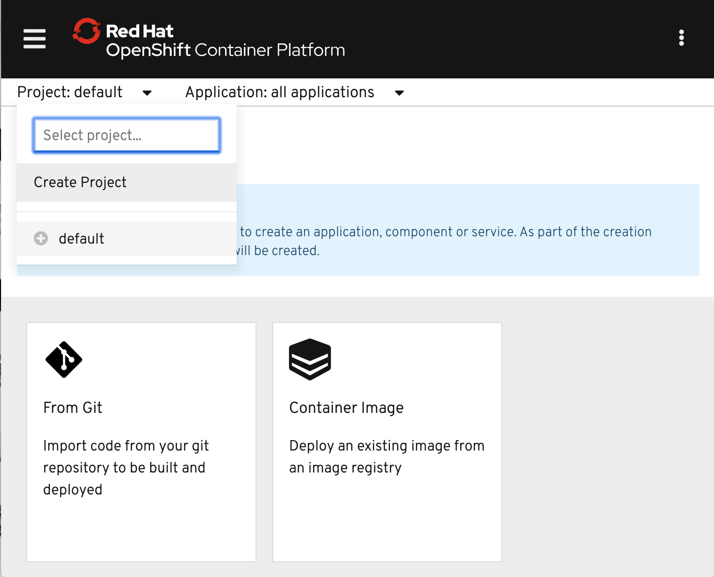

4. Fill in the Name and Display Name fields with `wild-west-userXX`. To make sure that the project is unique append your userid to the project name and click **Create**. <br>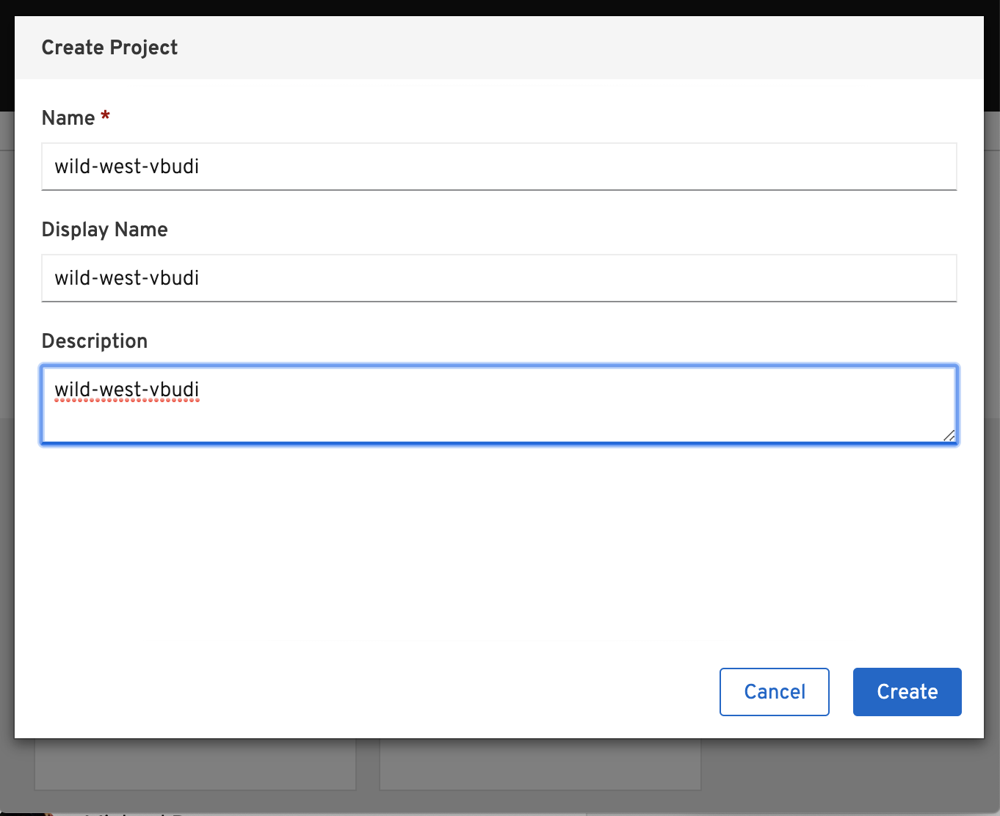

5. Click on the login name on the top right and select **Copy Login Command**. <br> 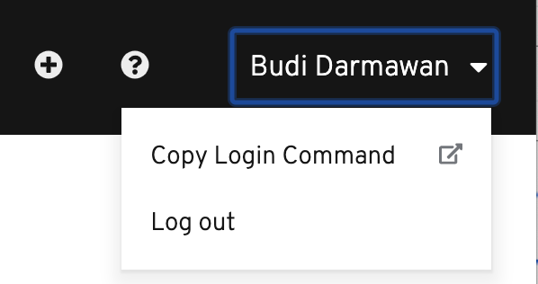<br> Under `Log in with...` on the login page, click **htpasswdidp**. If you saved your user id and password on your first login, your `Username` and `Password` fields will be filled in. Otherwise, enter them and click **Login**. On the next screen, click the **Display token** link and copy the `oc login` command to your buffer.

6. Now that you have setup your OpenShift environment, lets try to get the application. Open a Command Line (Terminal) session.

7. Paste the login command into the Terminal session and enter it: <br>


6. Go to an empty working directory and clone the application files from GIT:

  ```
  git clone https://github.com/gangchen03/wild-west-Kubernetes
  ```

7. Go to the directory `wild-west-Kubernetes/kubernetes`

  ```
  cd wild-west-Kubernetes/kubernetes
  ```

8. Deploy the application to OpenShift. Look into the file `k8s.yaml` and answer the following questions:

  - How many objects will be created by this yaml file? _____
  - What are the functions of the objects that will be created? ____________________________________

  ```
  oc project wild-west-userXX
  oc apply -f k8s.yaml
  ```

9. Go to the OpenShift console and click on **Topology** on the left navigation pane. Click on the OpenShift icon to get the detailed information. <br>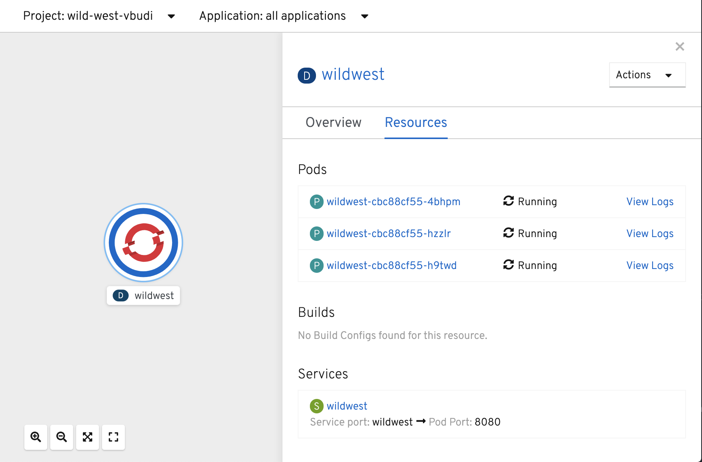

  - How many Pods were created? _____
  - What type of service was created? _______________
  - What object(s) have been defined but are not shown in the topology? _________


10. Can you access the application right now? ___________ <br>If yes, what is the URL of the application? __________________________________________

## Step 2 - Work with OpenShift Networking

In the first challenge here, you work to enable the application to be accessed.

1. What object is needed for the application to be accessible for you? ____________<br>
How can you create that object? ___________ or ____________

2. You can use either the Web console or the CLI to create the necessary object. The simplest method is running the CLI command (substitute your service name):

  ```
  oc expose svc <your-service>
  ```

3. Go back to the topology view. Has a new object been created? ____<br>What is the type of the new object? __________ <br>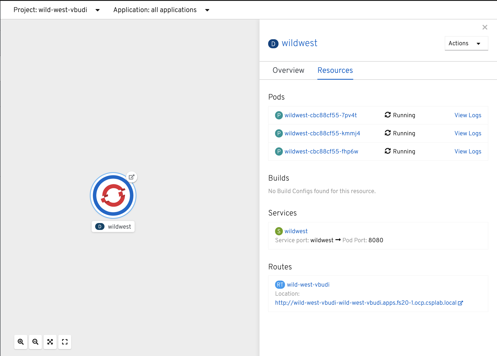

4. Now try to understand how these networking objects work:

  - The pods are running and serving the application on port _____
  - The service - load balances the pods and listens on port ______ - for incoming requests from the OpenShift nodes on _______ port.
  - The route detects requests to the URL ______________________________ and then forwards that to the service nodePort.

4. Right-click on the new object to get to your application in a new window, it should look similar to:<br>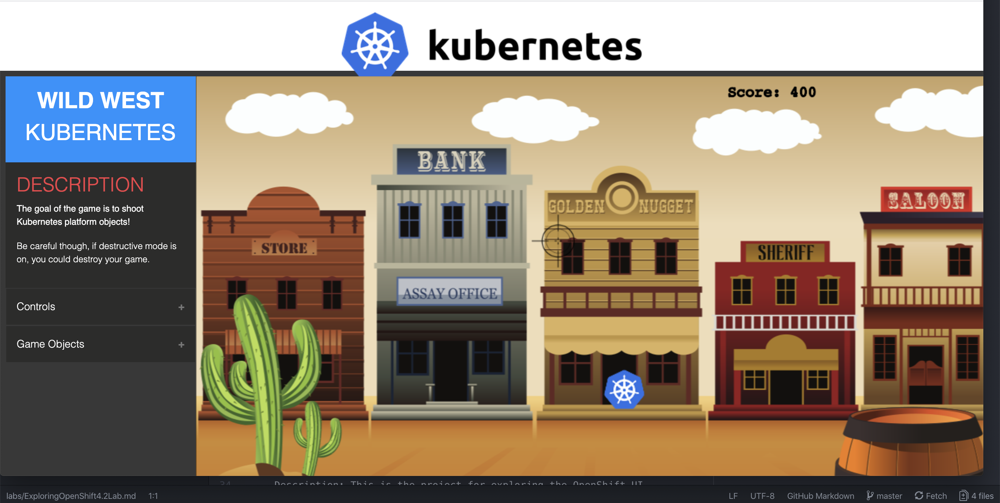

5. Play with the application for a little bit. Have your browser windows with the game and the topology with pod status shown side by side. Does the game work? _______

### Step 3 - Demonstrate Service Accounts and Role Bindings

Now let's try to see why even when you shoot the Kubernetes objects, they are not affected. Even though you see an explosion in the game, your topology pod status page does not show any pods being crashed. Let's go back and look at the RoleBinding object that you created in the `k8s.yaml` file.

```
apiVersion: rbac.authorization.k8s.io/v1
kind: RoleBinding
metadata:
  creationTimestamp: null
  name: view
roleRef:
  apiGroup: rbac.authorization.k8s.io
  kind: ClusterRole
  name: view
subjects:
  - kind: ServiceAccount
    name: default
```

Pods are run based on the authority of a ServiceAccount. In each project, the `default` ServiceAccount runs all pods that are not specifically assigned to any other ServiceAccount.

If you look at the yaml above, you see that the RoleBinding we have deployed allows the ServiceAccount `default` to VIEW objects in the OpenShift cluster. This is a read-only role. Therefore it can discover the pods and services, but the role does not allow the pods to be destroyed or changed.

Lets add the `edit` ClusterRole for the `default` ServiceAccount.

You can create a new YAML file based on the above snippet. In that new file, change all occurrences of `view` to `edit` and save the file. Apply the new YAML file using the command:

  ```
  oc apply -f <yamlfilename>
  ```

Play the game again and check the results. Is it now removing the pods? ______ and how about the services? _______  

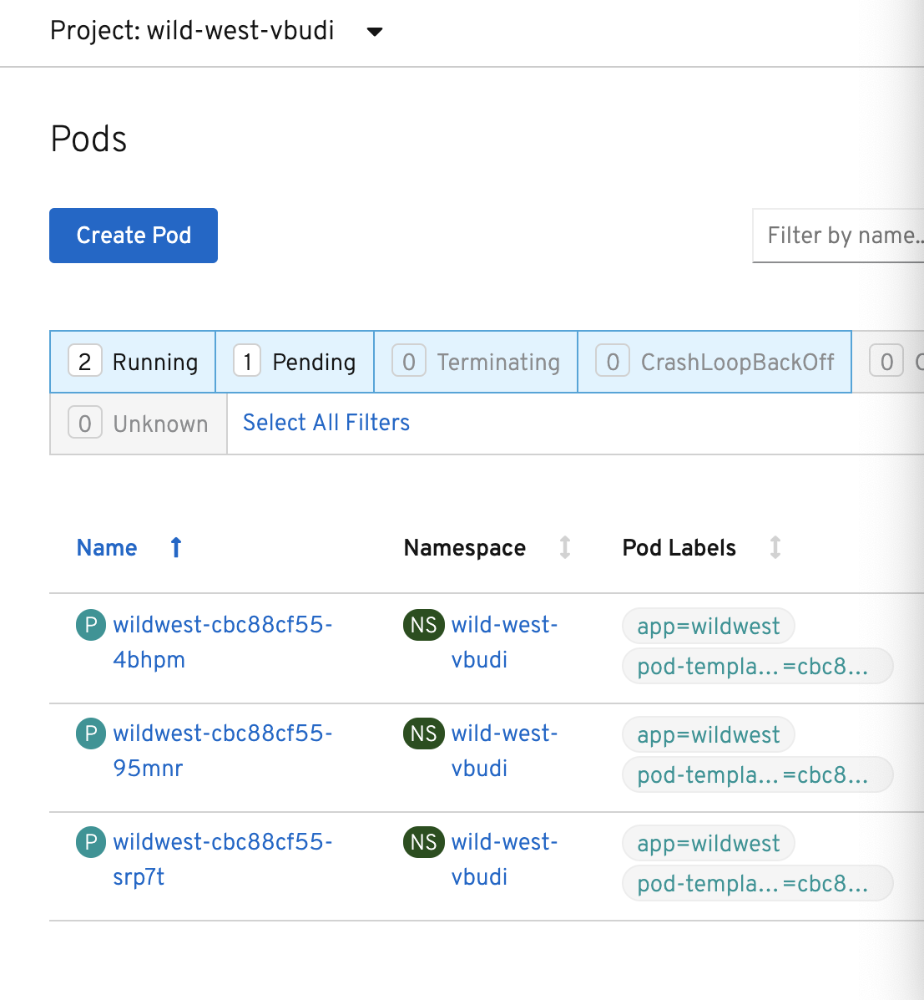

## Step 4 - Demonstrate Storage provisioning

OpenShift dynamic storage provisioning allows creation of a PhysicalVolumeClaim (PVC) based on a StorageClass. That means that an application can directly request a PVC without individually creating a PhysicalVolume (PV) to back it up.

1. In the OpenShift environment, check whether you have a StorageClass defined. Change to the Administrator view from the Developer view from the OpenShift Web console. <br>

2. Select in the left Navigation menu **Storage > Storage Classes** - take a note on the storage class name.

3. Now go to **Storage > Persistent Volume Claims** and click **Create Persistent Volume Claim**; select the Storage Class, give a name and size (1 Gi) and click **Create**. <br>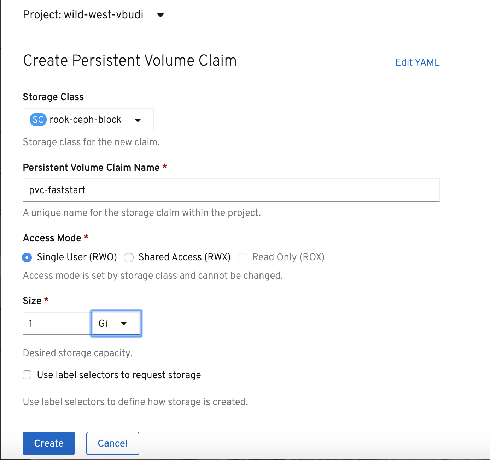

4. In the PersistentVolumeClaim page, the PVC status will remain as `Pending`. This is because on the public cloud we are using, the PVC does not become bound until a pod actually connects with it. It is OK for you to proceed to the next step with the PVC in the `Pending` state. 

<!-- 
<br>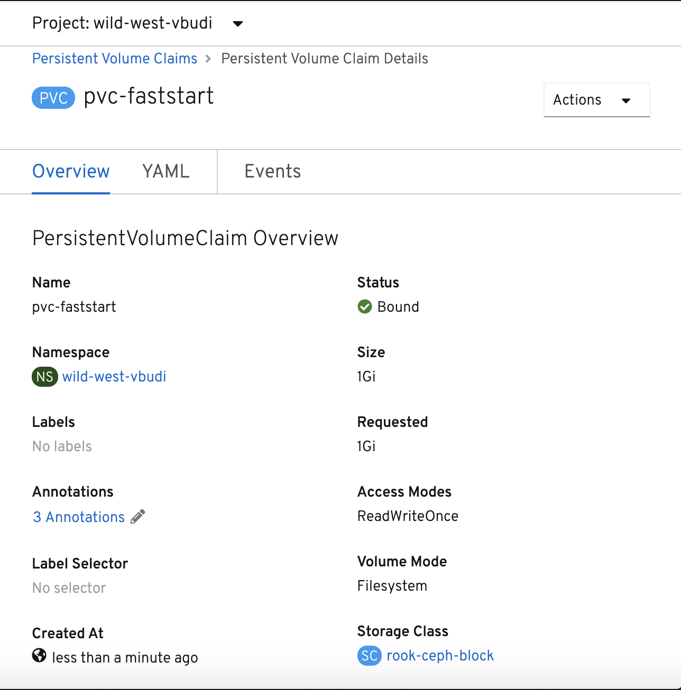
-->

5. Go back to the game and wait until a PVC object is shown (similar to a Drum or a Disk). When you click on it, go back to the PVC page and refresh it. It will show a 404 because the PVC is no longer there. <br>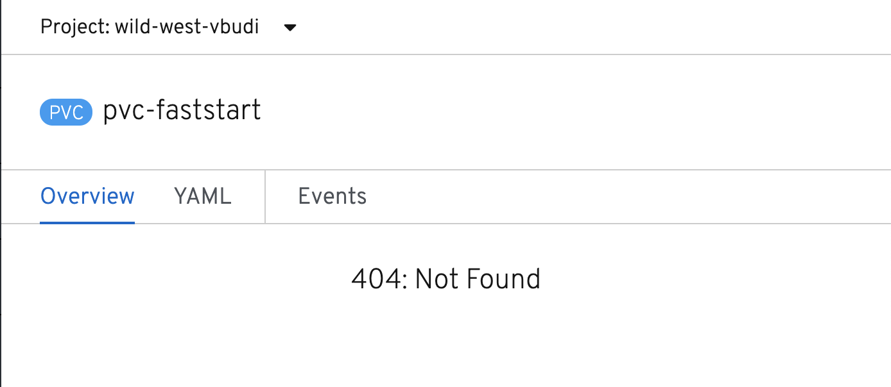


## Step 5 - Challenge: Why the service is not getting deleted? Explore the Source code  

Now that the game is working, destroying cluster components as you click on them, what about the service? The service never gets destroyed when you click on the icon. Why?

_Hint_:
The source is in the file `PlatformObjectHelper.java`


## Step 6 - Clean up

Please clean up after yourself, run the following commands from a terminal session:

```
oc delete rolebinding edit
oc delete rolebinding view
oc delete route wildwest
oc delete service wildwest
oc delete deployment wildwest
oc delete project wild-west-userXX
oc logout
```
